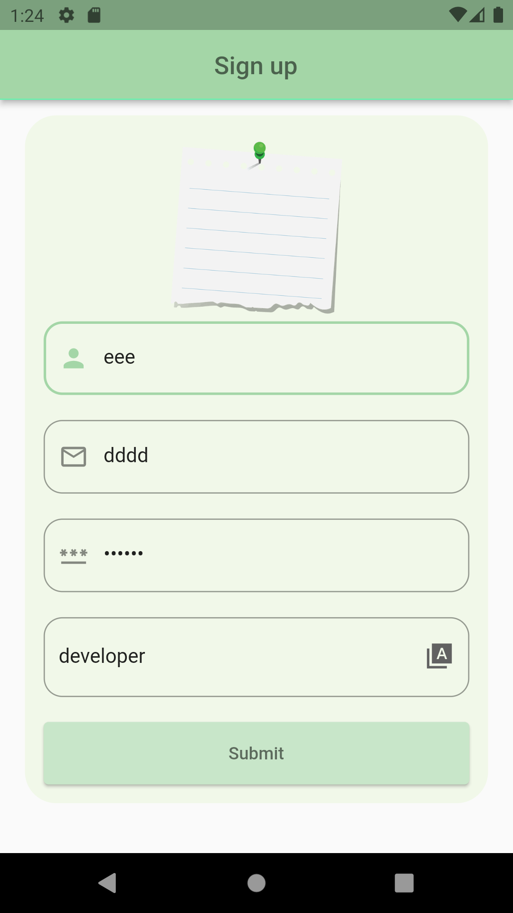

# my_notes

Project to create notes and share it with your friends,
this project build with __flutter__
 frontend  and __Laravel backend__ with these features
 1. Signup with sample design
 2. Login with Auth API with laravel
 3. share the link of the note

 ## Dart Packages
 - dio ^4.0.6
 - provider ^6.0.5

 ## Screens
 - signup screen, this screen connect with Post API from laravel

 

 ## Backend
 - Laravel 9  this [ repo](https://github.com/WaelAlQawasmi/ShareNotes-Laravel)